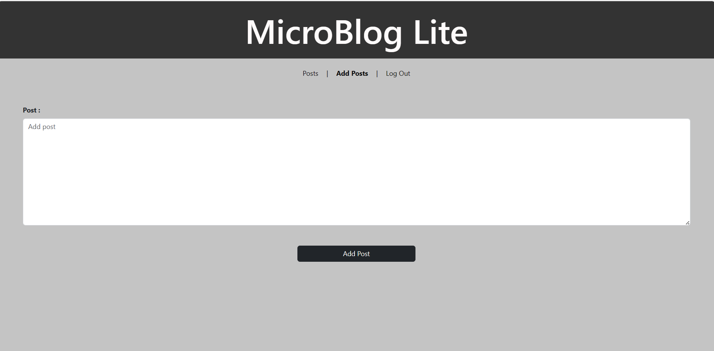

# MicroblogLite

MicroblogLite is a web application designed for blogging. Users can create accounts, log in, view, add, and delete blogs. The application provides a user-friendly interface for managing blog posts and interacting with the blogging community.

## Description

This web application allows users to perform various actions related to blogging. The features include:

### Login Page
- Users can log in to the website.
- Upon successful login, an authorization token is saved in local storage.
- A signup link is provided for new users to create an account.

  

### Registration/Signup Page
- New users can sign up and create an account.
- Password and confirm password fields must match.
- Users need to agree to terms and conditions for successful registration.
- Users with existing accounts can use the sign-in link for login.

  

### Posts Page
- Accessible to logged-in users.
- Users can view details and like different posts.
- Logged-in users can delete their own posts.
- Sorting and viewing posts based on likes, recent, and old posts is available.
- Navigation links allow users to move between pages.
- Users can log out using the logout link, deleting the token from local storage.
- Footer includes information about the website and useful links.

  

### AddPosts/Profile Page
- Accessible to logged-in users.
- Users can add multiple posts.
- Navigation links facilitate movement between different pages.
- Users can log out using the logout link, deleting the token from local storage.

  

## Tools Used
- Bootstrap
- VsCode IDE
- Git
- GitHub
- MySQL
- NodeJS
- Express

## Technologies Used
- HTML
- CSS
- Bootstrap framework
- JavaScript

## Authors
- https://github.com/Jcaro-041
- https://github.com/LavanyaMoole
- https://github.com/AJCamposss
- https://github.com/DeAsianDragon